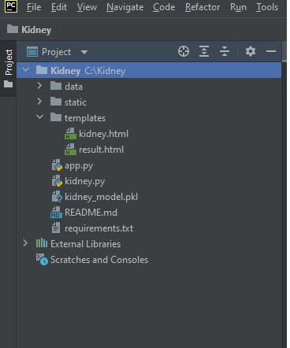
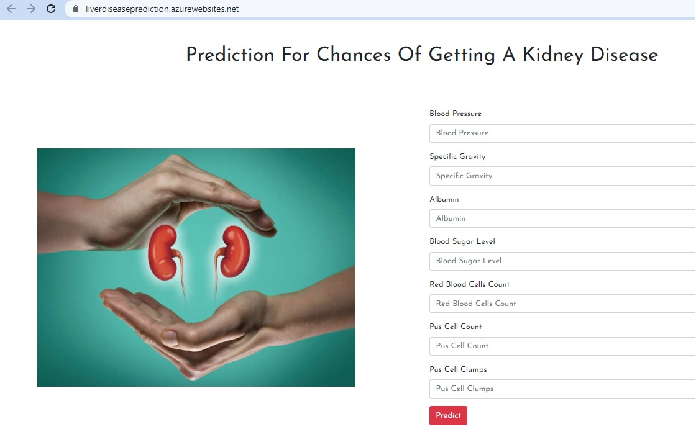

# BUILDING AN INTELLIGENT LIVER DISEASE PREDICTION SYSTEM 

It can perform prediction of liver disease based on required features mentioned on web application.

  
## Installation Screenshots

- All Directories

- Web App Working on AZURE Cloud

## Deployment

Deployed this project to AZURE Cloud

  
## Tech Stack

**Prpgramming Language:** Python

**Libraries:** Tensorflow,Numpy,Scikit-Learn,Pandas

**API:** Flask

**Frontend Frameworks:** HTML,CSS

**Web Server:** AZURE

**IDE:** Pycharm 

  
  
